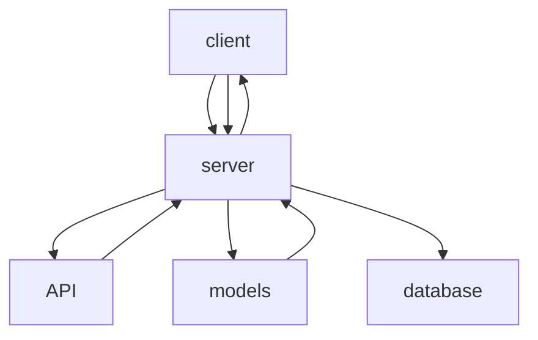
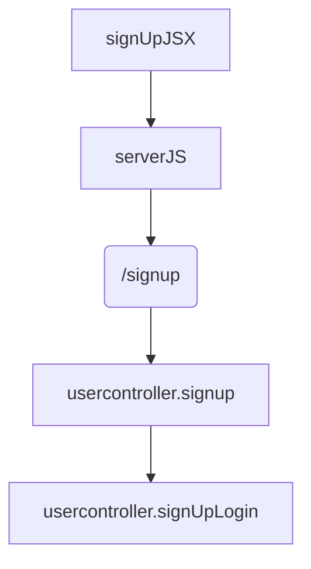
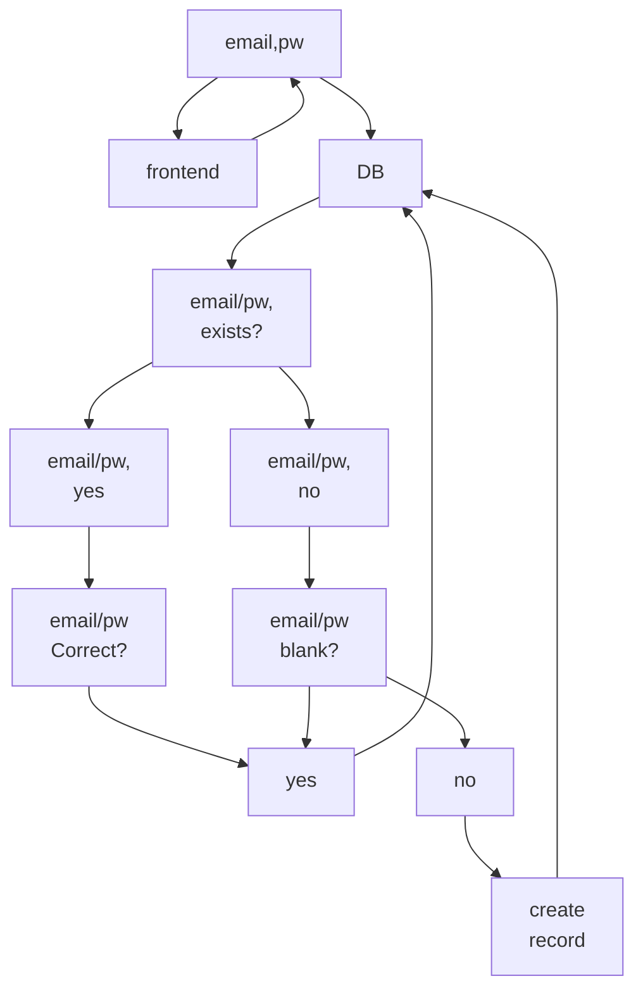

UC.login
UC.signup
UC.signuplogin
UC.loginExistscheck

```mermaid
graph 
UC.signup --> UC.loginExistscheck --> yes--> UC.login--> FE 
UC.loginExistscheck --> no -->UC.signup-->UC.signuplogin-->FE
UC.login-->UC.signuplogin
